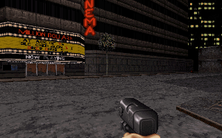

# dark_chocolate_duke3d

A modern **macOS / Apple Silicon (arm64)** port of Fabien Sanglard's
[chocolate_duke3D](https://github.com/fabiensanglard/chocolate_duke3D) — the
education-focused, source-faithful port of *Duke Nukem 3D* — brought up to
**SDL3** with a **CMake** build.



> **You must supply your own `DUKE3D.GRP`** (the full game *or* the shareware
> demo — you need a legal copy). No game data is included in this repository.

## Download & play (macOS, Apple Silicon)

1. Download the latest `dark_chocolate_duke3d-*-macos-arm64.dmg` from the
   [**Releases**](https://github.com/rcoural/dark_chocolate_duke3d/releases) page
   and open it. The build is signed with a Developer ID and **notarized by
   Apple**, so it opens with no Gatekeeper warnings.
2. Drag the `dark_chocolate_duke3d` folder out of the disk image (e.g. to your
   Desktop or `Applications`).
3. Copy your `DUKE3D.GRP` into that folder.
4. Double-click **`dark_chocolate_duke3d.command`** to play.

## Controls

| Action | Key |
| --- | --- |
| Move / strafe | `W A S D` / arrows |
| Turn | mouse |
| Fire | `Ctrl` |
| Open / use | `Space` |
| Weapons | `1`–`9` |
| Fullscreen | `Alt`+`Enter` |
| Free/grab mouse | `Ctrl`+`M` |
| Menu / back | `Esc` |

Window size: the game renders at 320×200 and scales to a 3× window by default;
set `DUKE_SCALE` (e.g. `DUKE_SCALE=4`) to change it.

## Build from source

Requirements: **CMake** and a C/C++ toolchain (Xcode Command Line Tools).
**SDL3** and **SDL3_mixer** are fetched automatically via CMake `FetchContent`,
so no system SDL install is needed.

```sh
cmake -S . -B build -DCMAKE_BUILD_TYPE=Release
cmake --build build -j
# run from a directory that contains your DUKE3D.GRP:
cd /path/to/duke3d-data && /path/to/build/chocolate-duke3d
```

## Music (MIDI)

Music is rendered through SDL3_mixer's FluidSynth backend and needs a SoundFont:

- The **release bundle** ships a small free SoundFont (*Vintage Dreams Waves*),
  so music works out of the box.
- When **building from source**, the game auto-detects a Homebrew FluidSynth
  SoundFont, or you can point to any General-MIDI `.sf2` with
  `DUKE_SOUNDFONT=/path/to/FluidR3_GM.sf2` for richer sound.

## What's different from upstream

- Video, input, palette and presentation ported from **SDL 1.2 → SDL3**.
- New **CMake** build (replaces the autotools / Visual Studio / Xcode projects);
  SDL3 + SDL3_mixer via `FetchContent`.
- Sound effects via the **SDL3 core audio API**; **MIDI music** via SDL3_mixer's
  new `MIX_*` API + FluidSynth.
- **64-bit (arm64)** correctness fixes across the renderer, the CON script VM
  and the gameplay code.
- Removed dead DOS-era code (audiolib hardware drivers, unused multiplayer).

See [CHANGELOG.md](CHANGELOG.md) for the full list.

## Status

Builds, runs and renders both the 2D menus and the 3D world (verified on E1L1).
Interactive play and the complete game content have not yet been exhaustively
tested — some untested code paths may still need 64-bit fixes. Contributions and
bug reports welcome.

## License & credits

Based on **Fabien Sanglard's chocolate_duke3D**. The underlying **Build engine**
is © Ken Silverman (see the per-file headers / BUILD license), and the **Duke
Nukem 3D game source** was released by 3D Realms under the **GPLv2**. This fork
preserves those licenses and copyright headers, is strictly non-commercial, and
ships **no game data** — you must own and supply your own `DUKE3D.GRP`.

The screenshot above is an in-game capture for documentation purposes;
*Duke Nukem 3D* and its artwork are © their respective owners.
